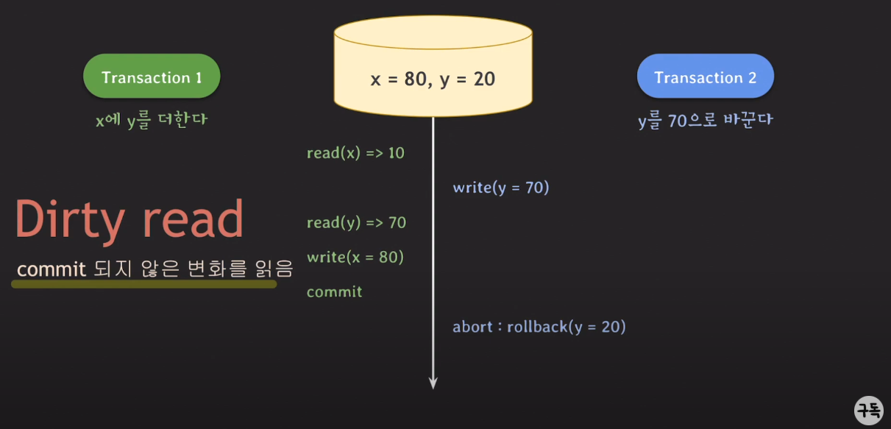
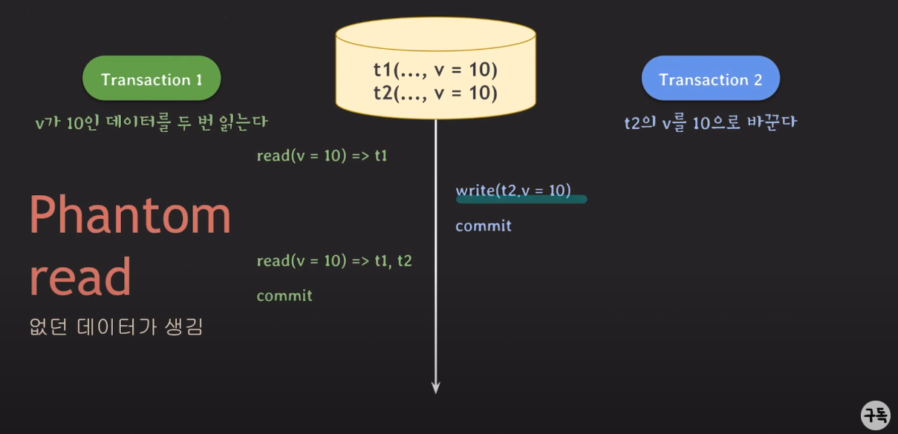
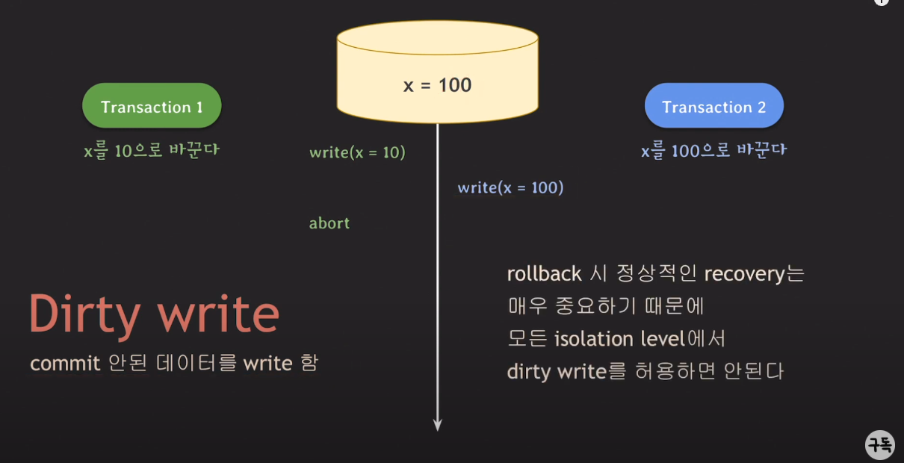
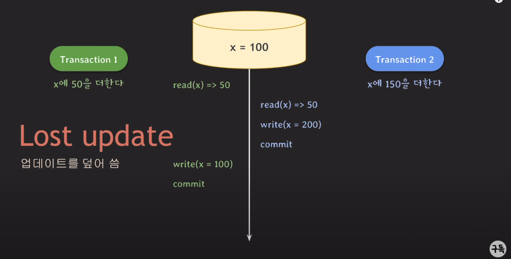
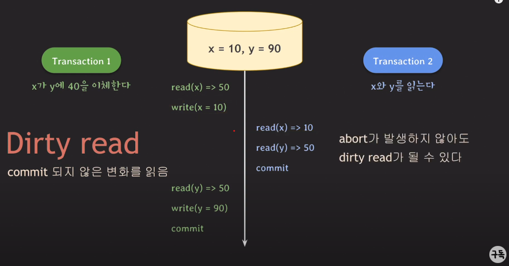
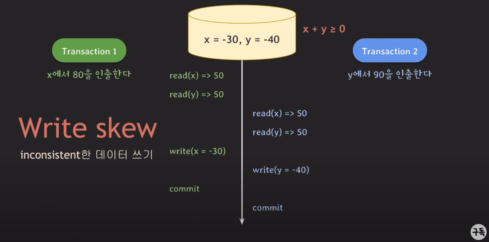
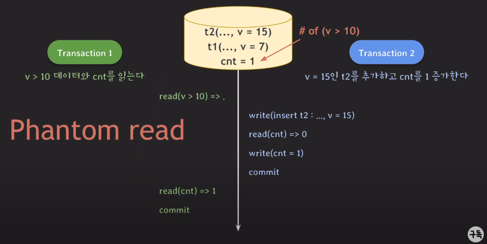
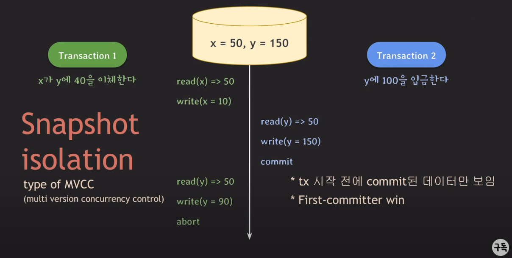

https://youtu.be/bLLarZTrebU?si=RIKbFDKMzMFRWL9O

#### 이상한 현상
  - **Dirty read**: commit 되지 않은 변화를 읽음

  - **Non-repeatable read(Fuzzy read)**: 같은 데이터의 값이 달라짐

  - **Phantom read**: 없던 데이터가 생김

  - 이러 이상한 현상들이 모두 발생하지 않게 만들 수 있지만 그러면 제약사항이 많아져서 동시 처리 가능한 트랜잭션 수가 줄어들어 결국 DB의 전체 처리량(throughput)이 하락하게 된다

#### 격리 레벨(Isolation level)
  - 일부 이상한 현상은 허용하는 몇 가지 level을 만들어서 사용자가 필요에 따라서 적절하게 선택할 수 있도록 하자
  - 애플리케이션 설계자는 isolation level을 통해 전체 처리량(throughput)과 데이터 일관성 사이에서 어느 정도 거래(trade)를 할 수 있다

| Isolation Level     | Dirty Read | Non-repeatable Read | Phantom Read |
|---------------------|------------|----------------------|--------------|
| Read Uncommitted    | O          | O                    | O            |
| Read Committed      | X          | O                    | O            |
| Repeatable Read     | X          | X                    | O            |
| Serializable        | X          | X                    | X            |
  - **1992년 11월에 발표된 SQL표준에서 정의된 내용**
  - **1995년 isolation level을 비판하는 논문이 발표됨 **
    1. 세 가지 이상 현상의 정의가 모호
    2. 이상 현상은 세 가지 외에도 더 있다
    3. 상업적인 DBMS에서 사용하는 방법을 반영해서 isolation level을 구분하지 않았다
   
#### 1995년 isolation level을 비판하는 논문에서 나온 추가 이상 현상

  - **Dirty write 확장판**: commit 안된 데이터를 write 함

  - **Lost Update**: 업데이트를 덮어 씀

  - **Drity read 확장판**: abort가 발생하지 않아도 Drity read가 될 수 있다

  - **Read skew**: inconsistent한 데이터 읽기

  - **Write skew**: inconsistent한 데이터 쓰기

  - **Phantom read 확장판**: 읽지않은 데이터의 값이 달라짐

#### Snapshot isolation
  - Transactional 시작 전에 commit된 데이터만 보임
  - 같은 데이터는 First-committer 한 Transactional이 이김

#### 실무에서 Isolation level
  - **MySQL(innoDB)**: 표준SQL과 동일
  - **Oracle**: Read Uncommitted 는 제공 안함, Repeatable Read를 사용하려면 Serializable 로 사용하라고 되어있음 즉, Oracle에서는 Read Committed와 Serializable 만 제공함
  - **SQL server**: Read Uncommitted, Read Committed, Repeatable Read 과 Snapshot 마지막으로 Serializable 순으로 제공한다
  - **postgreSQL**: 표준SQL과 동일하나 설명에 추가 이상 현상에 대해서 Serialization Anomaly로 설명하고 있으며 Repeatable Read 레벨이 Sanpshop 과 동일하다

  1. 주요 RDBMS은 SQL 표준에 기반해서 isolation level을 정의한다
  2. RDBMS마다 제공하는 isolation level이 다르다
  3. 같은 이름의 isolation level이라도 동작 방식이 다를 수 있다
  4. 사용하는 RDBMS의 isolation level을 잘 파악해서 적절한 isolation level을 사용할 수 있도록 해야 한다
